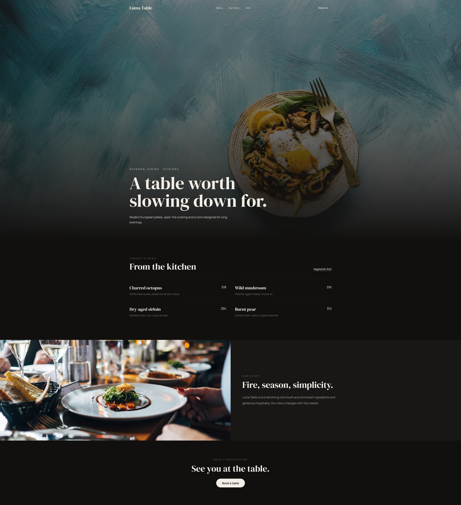
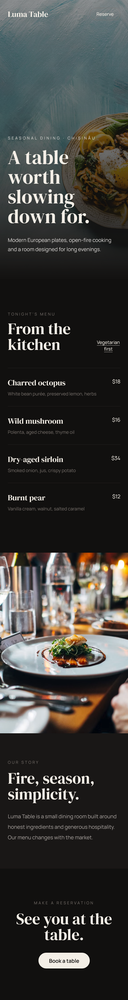

# Luma Table — Restaurant Website

An elegant and modern restaurant website concept designed for a premium dining experience.

## Preview

### Mobile Preview

## Live Demo

[View Live Demo](https://Bmax13.github.io/luma-table-restaurant/)

## About the Project

Luma Table is a restaurant website concept focused on atmosphere, high-quality food photography and a premium dining experience.

The interface combines strong typography, dark visual elements and large imagery to create an elegant restaurant presentation.

## Features

* Responsive restaurant website
* Hero section with call-to-action
* Menu presentation
* Restaurant information
* Food and interior imagery
* Reservation call-to-action
* Responsive navigation
* Mobile-friendly design
* Interactive JavaScript elements

## Technologies

* HTML5
* Tailwind CSS
* JavaScript
* Responsive Design

## Purpose

This project was created as a frontend portfolio project to demonstrate the ability to create visually engaging restaurant websites with responsive layouts and modern user interactions.
